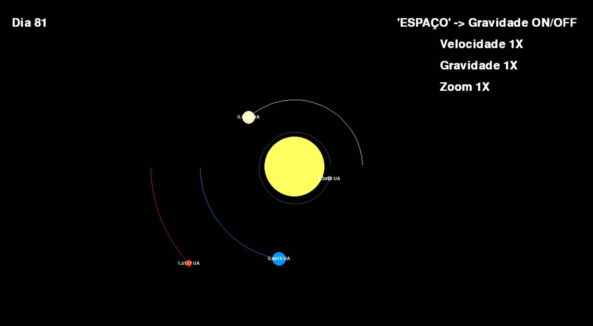

# Solar System Simulation

This is a Python-based simulation of the Solar System, built with Pygame. This program visually models the orbits of various planets around the Sun, incorporating basic gravitational physics and realtime adjustable parameters for speed, gravity, and zoom.

## Features

- **Planet Orbits:** The simulation displays the orbits of the planets around the Sun, with their positions updated based on simplified gravitational calculations.
- **Adjustable Simulation Speed:** Speed up or slow down the simulation to observe the planetary orbits at different time scales.
- **Gravity Control:** Toggle gravity to see the effect of turning it on and off on planetary movement. Increase it or decrease it also.
- **Zoom Functionality:** Zoom in or out to get a closer or broader view of the planetary system.

## Controls

- **Space Bar**: Toggle gravity on/off
- **Arrow Keys**:
  - **Right Arrow**: Increase simulation speed
  - **Left Arrow**: Decrease simulation speed
  - **Up Arrow**: Increase gravity multiplier
  - **Down Arrow**: Decrease gravity multiplier
- **A Key**: Zoom in
- **S Key**: Zoom out

## Prerequisites

- [Python 3.x]
- [Pygame](https://www.pygame.org/) (pip install pygame)

## License

This project is licensed under the MIT License - see the [LICENSE](LICENSE) file for details.
